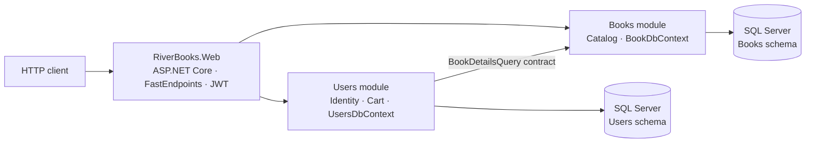
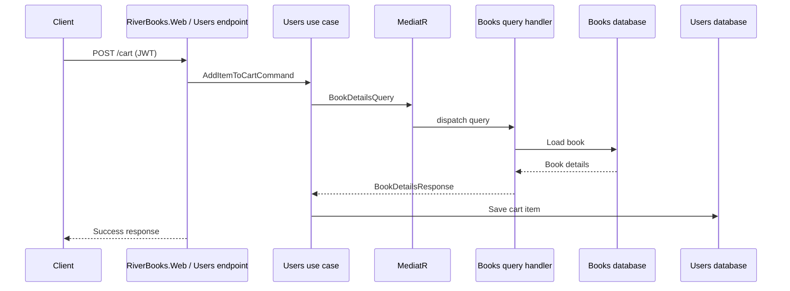

# RiverBooks

RiverBooks is a .NET 10 modular-monolith bookstore API. A single ASP.NET Core host exposes the Books and Users modules. The modules have separate application code, EF Core contexts, and migration histories; they can use separate SQL Server databases or separate schemas in the same database.

## Solution overview



The Users module requests catalog data through the Books contracts project rather than accessing the Books database directly:



### Projects

| Project | Responsibility |
| --- | --- |
| `RiverBooks.Web` | ASP.NET Core host, configuration, JWT authentication, FastEndpoints, Swagger/OpenAPI, and module registration. |
| `Books Module/RiverBooks.Books` | Book catalog endpoints, domain and service logic, repository, `BookDbContext`, and Books migrations. |
| `Books Module/RiverBooks.Books.Contracts` | Cross-module request/response contracts, including `BookDetailsQuery`. |
| `Users Module/RiverBooks.Users` | Registration and login, ASP.NET Core Identity, cart endpoints and use cases, `UsersDbContext`, and Users migrations. |
| `Books Module/RiverBooks.Books.Tests` | Books module test project. |
| `Users Module/RiverBooks.Users.Tests` | Users module test project. |

Both contexts use SQL Server and separate connection string keys: `BooksConnectionString` and `UsersConnectionString`. The included migrations create objects under the `Books` and `Users` schemas respectively. The Users migration history currently includes `Initial-Users` and `Cart-Items`; the latter adds `Users.CartItem` and `CustomerFullName` to the user table.

## API

The routes below are registered by FastEndpoints. Catalog and account routes currently allow anonymous access; cart routes require a JWT containing the `EmailAddress` claim.

| Method | Route | Purpose | Access |
| --- | --- | --- | --- |
| `GET` | `/books` | List books. | Anonymous |
| `GET` | `/books/{Id}` | Get a book. | Anonymous |
| `POST` | `/books` | Create a book. | Anonymous |
| `DELETE` | `/books/{Id}` | Delete a book. | Anonymous |
| `POST` | `/books/{Id}/pricehistory` | Update a book's price. | Anonymous |
| `POST` | `/users` | Register a user. | Anonymous |
| `POST` | `/users/login` | Authenticate and receive a JWT. | Anonymous |
| `GET` | `/cart` | List the authenticated user's cart. | JWT |
| `POST` | `/cart` | Add a book to the authenticated user's cart. | JWT |

In Development, the OpenAPI document is available at `http://localhost:5104/openapi/v1.json`. Example HTTP requests are in [HttpFiles/RiverBooks.Web.http](HttpFiles/RiverBooks.Web.http); Bruno requests are in [BrunoFiles/RiverBooks.Web - v1](BrunoFiles/RiverBooks.Web%20-%20v1/).

## Requirements

- .NET 10 SDK
- SQL Server instance reachable by the application
- Entity Framework Core CLI (`dotnet-ef`) for database migrations

Check the SDK version and install the EF CLI if needed:

```bash
dotnet --version
dotnet tool install --global dotnet-ef
```

Run commands below from the repository root. Restore, build, and run the API with:

```bash
dotnet restore RiverBooks.slnx
dotnet build RiverBooks.slnx
dotnet run --project RiverBooks.Web/RiverBooks.Web.csproj --launch-profile http
```

The HTTP launch profile listens on `http://localhost:5104`. The HTTPS profile listens on `https://localhost:7094` and `http://localhost:5104`:

```bash
dotnet run --project RiverBooks.Web/RiverBooks.Web.csproj --launch-profile https
```

## Configuration

The host reads `ConnectionStrings:BooksConnectionString`, `ConnectionStrings:UsersConnectionString`, and `Auth:JwtSecret`. Use connection strings appropriate for your SQL Server. Do not commit passwords, signing keys, or other secrets to settings files.

For Development, initialize User Secrets and set the required values:

```bash
dotnet user-secrets init --project RiverBooks.Web/RiverBooks.Web.csproj
dotnet user-secrets set --project RiverBooks.Web/RiverBooks.Web.csproj \
  "ConnectionStrings:BooksConnectionString" "<Books SQL Server connection string>"
dotnet user-secrets set --project RiverBooks.Web/RiverBooks.Web.csproj \
  "ConnectionStrings:UsersConnectionString" "<Users SQL Server connection string>"
dotnet user-secrets set --project RiverBooks.Web/RiverBooks.Web.csproj \
  "Auth:JwtSecret" "<long random signing key>"
```

For the `Testing` environment, `appsettings.Testing.json` supplies environment-specific settings. Environment variables can override them; use double underscores for nested keys, for example `ConnectionStrings__UsersConnectionString` and `Auth__JwtSecret`. Verify the effective connection target before applying migrations, especially if both contexts share a database.

## Database migrations

Each module owns its migrations. Apply them independently; updating one context does not update the other. The following commands target the `Testing` environment and use the corresponding module project plus the Web startup project:

```bash
dotnet ef database update \
  --project "../Books Module/RiverBooks.Books/RiverBooks.Books.csproj" \
  --startup-project "../RiverBooks.Web/RiverBooks.Web.csproj" \
  --context BookDbContext \
  -- --environment Testing

dotnet ef database update \
  --project "../Users Module/RiverBooks.Users/RiverBooks.Users.csproj" \
  --startup-project "../RiverBooks.Web/RiverBooks.Web.csproj" \
  --context UsersDbContext \
  -- --environment Testing

dotnet ef database update \
  --project "../OrderProcessing Module/RiverBooks.OrderProcessing/RiverBooks.OrderProcessing.csproj" \
  --startup-project "../RiverBooks.Web/RiverBooks.Web.csproj" \
  --context OrderProcessingDbContext 
```


Omit `-- --environment Testing` to use the default environment. Check the migrations known to each context with the same project, startup-project, context, and environment options:

```bash
dotnet ef migrations list \
  --project "Users Module/RiverBooks.Users/RiverBooks.Users.csproj" \
  --startup-project "RiverBooks.Web/RiverBooks.Web.csproj" \
  --context UsersDbContext \
  -- --environment Testing
```

Create a migration in the project that owns the changed model. For example, to add a Users migration:

```bash
dotnet ef migrations add <MigrationName> \
  --project "OrderProcessing Module/RiverBooks.OrderProcessing/RiverBooks.OrderProcessing.csproj" \
  --startup-project "RiverBooks.Web/RiverBooks.Web.csproj" \
  --context OrderProcessingDbContext \
  --output-dir Data/Migrations
```

```bash
dotnet ef migrations add Initial-OrderProcessing \
  --project "../OrderProcessing Module/RiverBooks.OrderProcessing/RiverBooks.OrderProcessing.csproj" \
  --startup-project "../RiverBooks.Web/RiverBooks.Web.csproj" \
  --context OrderProcessingDbContext \
  --output-dir Data/Migrations
```

For Books migrations, use `Books Module/RiverBooks.Books/RiverBooks.Books.csproj` and `BookDbContext` instead.

## Tests

Run all test projects in the solution:

```bash
dotnet test RiverBooks.slnx
```

The test projects target xUnit. Keep tests independent of external SQL Server services unless a test is explicitly intended to exercise database integration.
